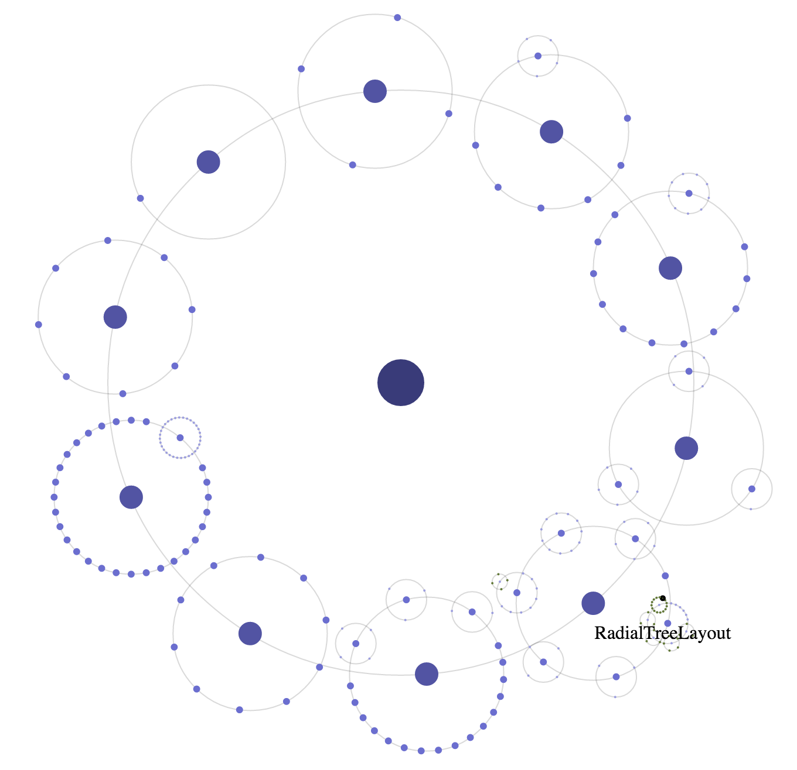

d3.layout.orbit
===============

`npm install d3-layout-orbit`

An animated hierarchical layout for d3.js that creates orbits from nested data.

You can see an interactive example [here](http://bl.ocks.org/emeeks/298e07ea67a640b5d9f4).

d3.layout.orbit accepts nested data in the same way that pack, tree and treemap do, and annotates it with xy coordinates for display as orbits. Orbital periods, sizes, and so on can be tied to data.

This layout is also animated in the same manner as d3.layout.force, with a tick function and recalculation xy coordinates on #orbit.start() and animation stopped on #orbit.stop()

**#orbit.size()**
The size of the layout. Currently only the first value is honored (circular orbits). In the future, elliptical orbits will also be supported.

**#orbit.orbitSize()**
The scaling of each individual ring. This can be a static value, and defaults to 2.95, or a function based on the attributes of each center of an orbit. The parent orbit is divided by this value to create the orbit at this level.

**#orbit.nodes()**
Set or get the data for this layout. Accepts a nested hierarchy but returns a flattened array of nodes.

**#orbit.children()**
Like pack, tree, etc, designate the child accessor function. Defaults to function(d) {return d.children}.

**#orbit.orbitalRings()**
Returns an array of datapoints with x, y, and r values for circles corresponding to orbits.

**#orbit.start()**
Begin animating. A "tick" event is fired every 10ms and node XY coordinates are recalculated based on speed and revolution settings.

**#orbit.stop()**
Stop animating.

**#orbit.speed()**
The speed, in degrees per 10ms, at which the nodes move.

**#orbit.revolution()**
A node-specific speed modifier that can be based on node data. For instance, if you want nodes at lower depths to move faster, you can set #orbit.revolution(function(d) {return d.depth}).

**#orbit.mode()**

**"flat"** is the default, demonstrated in earlier [examples that use flare.json](http://bl.ocks.org/emeeks/298e07ea67a640b5d9f4).

**"solar"** arranges each satellite in its own ring, equally divided from the set size of the layout.

**"atomic"** places 2 satellites in orbit in the first ring and 8 in every ring after that.

**"custom"** is achieved by passing an array of integers. Each integer sets the number of satellites in that ring, with the final value used to set the number of satellites in all remaining rings. Under the hood, "solar" could be achieved by passing [1], "atomic" could be achieved by passing [2,8] and "flat" could be achieved by passing [9999].